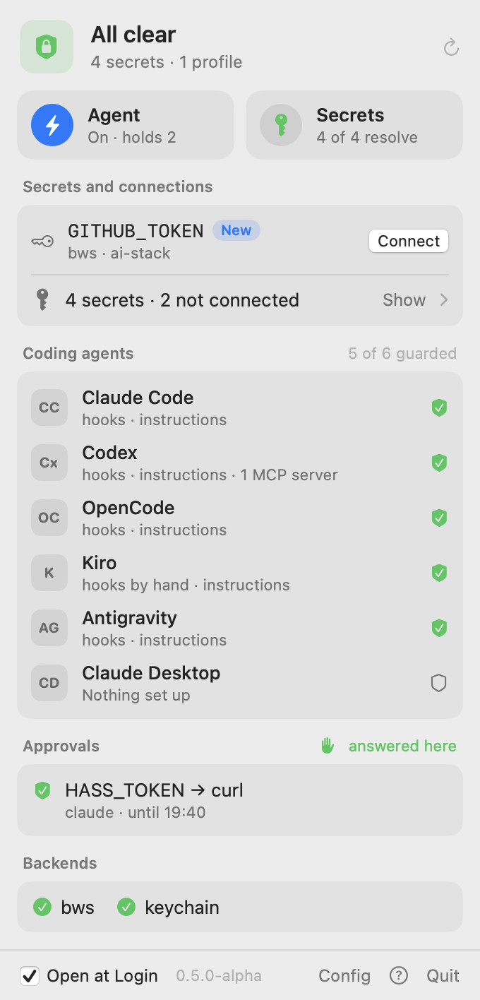
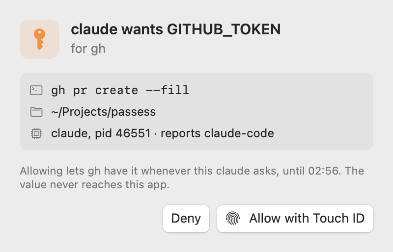
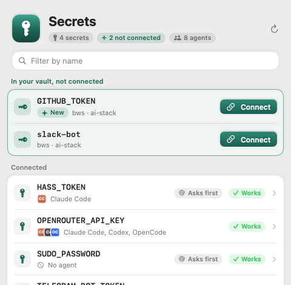
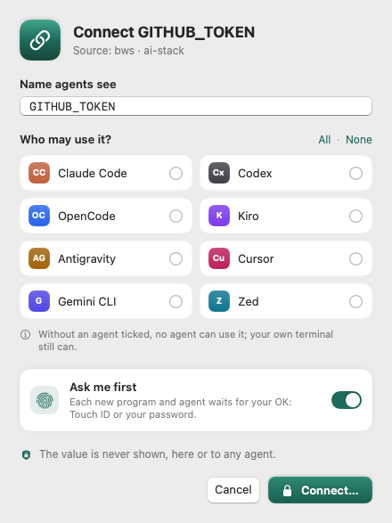

# passess

**The last mile between your password manager and your AI coding agents.**

> Status: alpha. Try it on secrets you can rotate.
> Works today: `exec`, `run`, `list`, `check`, `add`, `doctor`, `mcp-exec`,
> `install` / `status` / `uninstall` for eleven harnesses, and `scan`, `audit`,
> `migrate` and `inventory` for secrets already sitting in clear. References can point
> at 1Password, Bitwarden (Secrets Manager or Password Manager), Vault / OpenBao, the OS
> keychain or an environment variable. Guard hooks refuse the few actions that would
> put a value into an agent's context in seven harnesses. `passess agent` caches
> resolved values and runs agent commands itself. Plus the macOS menu bar app.

AI coding agents need API keys and passwords to do real work, and today those secrets
end up everywhere: plaintext tokens in MCP config files, `.env` files the agent reads,
`env` and `curl -v` output that lands in the model's context, keys pasted into chat,
secrets committed by the agent. Once a value reaches the context it also reaches the
provider's logs, session transcripts and memory stores.

passess is not a new vault. You keep your secrets where they already are — Bitwarden
(Password Manager or Secrets Manager), 1Password, HashiCorp Vault / OpenBao or the macOS
Keychain. passess stores only *references* (`op://…`, `bws://…`, `vault://…`), resolves
them at the last moment into the one subprocess that needs them, and scrubs the values
from whatever comes back. By default the agent never sees a value.

## How it works

```sh
# The agent runs a command that needs a secret. The value goes into the child's
# environment only; anything the child prints is redacted.
passess exec -s GITHUB_TOKEN -- gh api user

# MCP servers are registered in every harness as `passess mcp-exec <name>`, so no
# harness config file holds a token.
passess mcp-exec github

# Services and dev servers get a named profile with a clean environment.
passess run web -- npm run dev
```

`run` redacts the program's output, at a terminal too. A profile for a full-screen
program that needs the terminal itself sets `tty = true`; it then gets the terminal,
unredacted, when you run it at one with no agent detected.

The same references and policy work across Claude Code, Codex, OpenCode, Kiro,
Antigravity, Gemini CLI, Cursor, VS Code / Copilot, Windsurf, Zed and Claude Desktop.
See [docs/ROADMAP.md](docs/ROADMAP.md) for what lands when.

## Install

```sh
brew install afsharid/tap/passess
```

Or with Go 1.27.1 or newer:

```sh
go install github.com/afsharid/passess/cmd/passess@latest
```

Or download a release: macOS and Linux binaries for arm64 and amd64, `checksums.txt`,
and the menu bar app for Apple silicon. Each file carries a build provenance
attestation:

```sh
gh attestation verify passess_*_darwin_arm64.tar.gz --repo afsharid/passess
```

## Quick start

Put a secret in the macOS Keychain (the value is prompted for, never typed on the
command line), then describe it in `~/.config/passess/config.toml`:

```sh
security add-generic-password -U -s passess -a github -w
```

```toml
version = 1

[secrets.GITHUB_TOKEN]
ref   = "keychain://passess/github"
allow = ["gh", "git"]
```

```sh
passess exec -s GITHUB_TOKEN -- gh api user   # the value reaches gh only
passess exec -s GITHUB_TOKEN -- sh -c 'echo $GITHUB_TOKEN'
# refused: shells get no secrets unless the allow list names them
```

A reference can point at any of these; give several and the first that resolves wins:

| Reference | Backend | passess reaches it with |
|---|---|---|
| `op://vault/item/field` | 1Password | the `op` CLI: desktop app sign-in, or `OP_SERVICE_ACCOUNT_TOKEN` |
| `bws://<project>/<KEY>` or `bws://<uuid>` | Bitwarden Secrets Manager | the `bws` CLI; its machine token in the keychain: Connect your vault in Passess.app, or `passess backend bws` (another place with `backends.bws.access_token`) |
| `bw://item/field` | Bitwarden Password Manager | the `bw` CLI with an unlocked session (`BW_SESSION` or `backends.bw.session`) |
| `vault://mount/path#key` | HashiCorp Vault, OpenBao | HTTP, KV v2 or v1; token from `backends.vault.token`, `VAULT_TOKEN`, `BAO_TOKEN` or `~/.vault-token` |
| `keychain://service/account` | macOS Keychain, Linux Secret Service | `security` / `secret-tool` |
| `env://NAME` | an environment variable | — |

Other commands: `passess list` (names, backends, who may receive them), `passess
check` (which secrets resolve, never their values), `passess add NAME --ref …` or
`passess add NAME --keychain` (you type the value into the keychain yourself), and
`passess doctor` (what is wrong and the command that fixes it). Each takes `--json`.

### Which coding agents may use a secret

`clients` connects a secret to the coding agents that may ask for it. Without it every
agent may; `clients = []` means none. A command an agent left out asks for is refused,
whether the agent shows in the caller's environment or among its parent processes
([ADR 10](docs/adr/0010-secrets-name-the-agents-they-are-connected-to.md)). Your own
terminal is not an agent and keeps what `allow` says.

```toml
[secrets.OPENROUTER_API_KEY]
ref     = "bws://92fe9fe6-c441-4b27-b261-b4b9007117b9/OPENROUTER_API_KEY"
clients = ["claude-code", "codex"]   # claude-code, codex, opencode, kiro, antigravity, cursor, gemini-cli, zed, dsh
```

```sh
passess discover                     # bws secrets passess does not use yet, by name only
passess add GITHUB_TOKEN --ref bws://<project>/GITHUB_TOKEN --clients claude-code --approve
passess set GITHUB_TOKEN --clients claude-code,codex --approve false
passess remove GITHUB_TOKEN          # passess forgets it; the vault keeps it
```

`add`, `set`, `remove` and `discover` are yours to run: they refuse inside an agent, and
the hooks refuse them in agent shells. Passess.app does the same in a few clicks.

## MCP servers without tokens in harness configs

Define each server once, in passess config:

```toml
[mcp.github]                                  # a local stdio server
command = ["github-mcp-server", "stdio"]
env     = { GITHUB_PERSONAL_ACCESS_TOKEN = "GITHUB_TOKEN" }

[mcp.tracker]                                 # a remote streamable-HTTP server
url       = "https://mcp.example.com/mcp"
headers   = { Authorization = "Bearer {{TRACKER_TOKEN}}" }
harnesses = ["codex"]                         # only there; without it, every harness gets it
```

`passess migrate mcp` sets `harnesses` to the harness a server came from, so moving it
into passess does not spread it anywhere else.

Then let passess register them with your harnesses:

```sh
passess install            # dry run: shows what would change in every harness it finds
passess install --apply    # registers each server as `passess mcp-exec NAME`
passess install cursor zed --apply   # or only some of them
passess status             # what each harness runs, and any credentials still in clear
```

The harness config ends up holding only `passess mcp-exec github`. The local server
gets its secret in its environment. For a remote server, passess runs a stdio bridge
that adds the header itself, so even harnesses started from the Dock work. Output
from either comes back redacted.

| Harness | How passess registers servers | Instructions it adds to |
|---|---|---|
| Claude Code | `claude mcp` | `~/.claude/CLAUDE.md` |
| Codex | `codex mcp` | `~/.codex/AGENTS.md` |
| Antigravity | `agy mcp`, reading `~/.gemini/config/mcp_config.json` | `~/.gemini/config/rules/passess.md` |
| OpenCode | edits `~/.config/opencode/opencode.json(c)` | `~/.config/opencode/AGENTS.md` |
| Kiro | edits `~/.kiro/settings/mcp.json` | `~/.kiro/steering/passess.md` |
| Gemini CLI | edits `~/.gemini/settings.json` | `~/.gemini/GEMINI.md` |
| Zed | edits `context_servers` in its `settings.json` | `~/.config/zed/AGENTS.md` |
| Cursor | edits `~/.cursor/mcp.json` | — |
| VS Code | edits the user `mcp.json`, if it exists | — |
| Windsurf | edits its `mcp_config.json`, if it exists | — |
| Claude Desktop (macOS) | edits `claude_desktop_config.json` | — |

When passess edits a file, only its own entries change. Comments, key order and
formatting stay, a symlinked config is changed where it points, and `uninstall`
restores the file byte for byte ([ADR 7](docs/adr/0007-edit-harness-configs-by-splicing.md)).
Files are backed up under `~/.local/state/passess/backups` first, and
`passess uninstall --apply` takes everything out again.

## Guard hooks

`passess install` also registers `passess hook` with each harness. Before a tool runs, it
refuses the actions that would put a secret value into the conversation:

- environment dumps: `env`, `printenv`, `set`, `export -p`;
- reads of `.env` files, keys and credential files (`~/.aws/credentials`, `gh`'s token,
  harness sign-ins);
- vault reads that print a value: `op read`, `bws secret get`, `bw get`, `vault kv get`,
  `security … -w`, `gh auth token`;
- `$TOKEN` in a command line for a credential;
- a prompt with a pasted credential in it;
- an agent rewriting the passess config;
- ways around the agent: `passess agent stop`, `serve` or `approve`, `passess helper`,
  `PASSESS_CONFIG=` or `PASSESS_AGENT_SOCK=` in a command, and anything but passess
  talking to the agent's socket.

Each refusal tells the agent what to run instead. Tool output is redacted where the
harness allows it: with a running agent, first by the agent, which masks the values it
holds and hands none back. A new session learns which secret names exist.

| Harness | Where the hook goes | Refuses | Redacts output | Prompt guard | Session note |
|---|---|---|---|---|---|
| Claude Code | `~/.claude/settings.json`, or the plugin below | yes | yes | yes | yes |
| Codex | `~/.codex/hooks.json` (trust it once with `/hooks`) | yes | no way to | yes | yes |
| Gemini CLI | `~/.gemini/settings.json` | yes | yes | yes | yes |
| Cursor | `~/.cursor/hooks.json` | yes | — | yes | yes |
| OpenCode | `~/.config/opencode/plugins/passess.js` | yes | yes | yes | via `AGENTS.md` |
| Antigravity | `~/.gemini/config/hooks.json` | yes | no way to | no such event | via its rules file |
| Kiro | by hand, in an agent profile (below) | yes | no way to | yes | yes |

Shell commands are parsed, not pattern-matched, so `bash -lc 'cat .env'` and
`echo $(printenv)` are caught while `cp .env.example .env` and `printenv PATH` pass.
Anything the hook cannot parse, or fails on, is allowed. A hook adds about 4–5 ms to a
tool call. Hooks are a second line of defense: several ways into the context (file
watchers, pasted attachments, compaction) never fire one. The first line is that the
values are not in the agent's environment or files at all.

In Claude Code you can use the plugin instead of `install`'s hook entries (not both). It
needs `passess` on PATH:

```text
/plugin marketplace add afsharid/passess
/plugin install passess@passess
```

Kiro keeps hooks inside agent profiles, which passess leaves to you. Add this to the
profile's JSON:

```json
"hooks": {
  "agentSpawn": [{"command": "passess hook kiro agentSpawn"}],
  "userPromptSubmit": [{"command": "passess hook kiro userPromptSubmit"}],
  "preToolUse": [{"matcher": "*", "command": "passess hook kiro preToolUse"}]
}
```

## HTTP requests, bound to their hosts

A token given to `curl` through `exec` goes wherever the agent points curl. Name the
hosts a secret belongs to, and let passess send the request:

```toml
[secrets.GITHUB_TOKEN]
ref   = "op://Dev/GitHub PAT/credential"
hosts = ["api.github.com"]          # *.example.com covers subdomains
```

```sh
passess http -s GITHUB_TOKEN -H 'Authorization: Bearer {{GITHUB_TOKEN}}' https://api.github.com/user
```

`{{NAME}}` stands for the secret in headers, the body (`-d`, `-d @file`) and the URL.
The request goes out over https only (plain http only to this machine), to a host
every secret in it names. Redirects are followed only among those hosts. What comes
back is redacted. A secret without `hosts` goes nowhere through `passess http`. The
agents' instructions and the hooks now teach this form.

## A harness's own API key

A harness that runs a command to get its API key can get it from passess, and the key
leaves its settings file. For Claude Code, in `~/.claude/settings.json`:

```json
{ "apiKeyHelper": "passess helper ANTHROPIC_API_KEY" }
```

The value leaves passess on purpose here, so each secret opts in:

```toml
[secrets.ANTHROPIC_API_KEY]
ref   = "op://Dev/Anthropic/credential"
allow = ["passess-helper"]
```

`passess helper` prints nothing on a terminal, asks the agent first for a secret marked
`approve`, and the hooks refuse it in agent shells. This keeps the key off disk. It
does not keep it from the harness's own agent, which can run what the harness runs.

A desktop app passess knows, DeepSeek Harness (`dsh`) for now, needs no allow entry:
connecting the secret to it by name in Passess.app is the opt-in, and only the app's
own process, not a shell under it, gets the value. A secret connected to every agent
does not count. The app side is a plugin passess carries: Set up in Passess.app, or
`passess install dsh --apply`, puts it in the app's profile, and `passess status dsh`
shows each key the app asks for and whether it reaches the app (ADR 11).

## Secrets already in clear

Most machines that run agents already have tokens in MCP configs, shell startup files
and `.env` files, and in transcripts of sessions where a key was pasted. passess finds
them and moves them, and never prints one while doing it:

```sh
passess scan                  # harness configs and their backups, dotfiles, .env files under here
passess scan --transcripts    # also session transcripts; can take a while
passess scan --scrub --apply  # replace your values in the transcripts that hold them
passess audit                 # harness settings and files that hand credentials to agents
passess migrate env .env      # dry run: which lines would move into the keychain
passess migrate mcp codex tracker --apply   # move an inline MCP credential, switch Codex to mcp-exec
passess inventory > SECRETS-INVENTORY.md    # where every secret lives and what receives it
```

- `scan` combines the gitleaks rule set with the exact values of every secret you have
  configured, in all their encodings. A finding is a file, a line, a rule or secret name
  and a fingerprint keyed for that run, so it matches across files but cannot be checked
  against a guess.
- `audit` checks what the harnesses do by default, such as Codex handing every
  `*TOKEN*` variable to the commands the agent runs (measured on 0.155). Each
  finding comes with the command or edit that fixes it; audit changes nothing.
- `migrate` is a dry run unless `--apply`. It asks about each value, refuses to run
  under an agent, and takes a backup first. The backup still holds the old values, so
  remove it once everything works (the command is printed). A value that sat in a file an
  agent could read should be rotated at its provider anyway.
- `scan --scrub` is a dry run unless `--apply`. It replaces only the exact values of
  your configured secrets, with `[REDACTED:NAME]`, and only in transcripts. Each file is
  backed up first, and keeps its mode and its modification time, which harnesses sort
  sessions by. It leaves a session written in the last ten minutes alone. The backup
  keeps the values, so remove it once the sessions look right. Scrubbing a transcript
  does not unsend it: rotate what it held.
- `inventory` is built from configs alone, so nothing is resolved.

## The agent

Every `passess exec` asks the vault again: 0.4–0.5 s through the `bws` CLI, more
behind a Touch ID prompt. `passess agent` keeps the values it resolved in memory for
`agent.cache_ttl` (10 minutes by default) and runs agent commands itself, so a cached
secret costs one socket round trip:

```sh
passess agent start     # in the background; `passess agent serve` stays in the foreground
passess agent status    # pid, config, which secrets it holds (names) and until when
passess agent lock      # forget every value now
passess agent stop
```

The agent never hands a value to anyone. `exec` gives it the command, its environment
and its stdin, stdout and stderr; the agent applies the same policy, starts the child,
redacts what it prints and returns its exit status. Commands at a terminal, `run` and
`mcp-exec` keep running in-process. After upgrading passess, run `passess agent start`:
the running agent refuses clients of another version rather than run them under its old
policy, and `start` replaces it with one of this version serving the same config
([ADR 8](docs/adr/0008-the-agent-runs-the-child.md)).

```toml
[agent]
cache_ttl = "30m"   # "0" resolves for every command
```

### Approvals

A secret marked `approve = true` waits for your Allow before it goes to a program. You
answer once per program and per agent session: an Allow is remembered for that program
family and the harness process that asked. That process is the caller's nearest
ancestor that is not a shell, so an Allow given to one Claude Code session is not one
for another session, or for anything else on the machine
([ADR 9](docs/adr/0009-approvals-belong-to-the-callers-anchor.md)).

```toml
[secrets.GITHUB_TOKEN]
ref     = "op://Dev/GitHub PAT/credential"
approve = true

[agent]
approval_ttl     = "8h"    # how long an Allow lasts; "0" asks every time
approval_timeout = "60s"   # how long a question waits
```

```sh
passess agent approve   # answer questions here, in a terminal of your own
```

With no approver running, the answer is no, and so it is when no agent runs.
Passess.app will answer with Touch ID. `passess agent status` lists the live Allows;
`lock` forgets them. The agent keeps a log of names, programs and answers, never a
value, in `agent-audit.jsonl` next to its socket.

## macOS menu bar app

`Passess.app` puts passess in the menu bar. Its panel shows:
- whether everything is fine, and every problem with its fix, copyable;
- two tiles: the agent, which you switch on and off here, and the secrets, whose
  check shows which resolve (names and sources only);
- secrets that turned up in your vault and are not connected yet, each with Connect,
  and the way into the Secrets window;
- the coding agents: which have passess's hooks, instructions and MCP servers,
  and the `passess install` line for any that needs setup;
- the live approvals, and whether each backend is usable.

The Secrets window lists every secret with the coding agents it is connected to, and
the vault's secrets passess does not use yet. Connect, or a click on a secret, opens a
window with a checkbox per agent and "ask me first"; Save asks for Touch ID or your
password, then runs `passess add` or `set`. No terminal, no config file.

When an agent needs your approval, a window asks who wants which secret for which
command, and Allow takes Touch ID. The app never receives a value. It follows the Mac's
language: English, or Turkish.

<p>
<picture>
  <source media="(prefers-color-scheme: dark)" srcset="docs/images/menubar-panel-dark.png">
  
</picture>
<picture>
  <source media="(prefers-color-scheme: dark)" srcset="docs/images/menubar-approval-dark.png">
  
</picture>
</p>
<p>
<picture>
  <source media="(prefers-color-scheme: dark)" srcset="docs/images/menubar-secrets-dark.png">
  
</picture>
<picture>
  <source media="(prefers-color-scheme: dark)" srcset="docs/images/menubar-connect-dark.png">
  
</picture>
</p>

```sh
make macos-app        # needs only the Xcode Command Line Tools
open bin/Passess.app
make macos-previews   # the panel and the windows in sample states, as PNG files
```

It bundles its own copy of the CLI, and starts the agent with the `passess` on your
PATH, which is the one your harnesses run. The build is ad-hoc signed, so the first
launch of a copy downloaded from elsewhere needs right-click → Open.

## What it protects against — and what it does not

- **Accidental exposure** (the common case): an agent reading `.env`, dumping the
  environment, printing a header while debugging. This is the primary target.
- **Plaintext at rest**: tokens in harness configs, dotfiles, `.env` files and transcripts.
- **Over-broad access**: every process inheriting every secret.
- **Prompt-injection exfiltration** is made harder (per-secret command allow lists, no
  shells or interpreters by default), not impossible.
- **A deliberately malicious agent with an unsandboxed shell running as your user** is
  out of scope: it can read anything you can. A hard boundary needs the harness sandbox
  with passess outside it.

Redaction is best effort, not a sandbox. Harness hooks are defense in depth, not the
mechanism: several ingestion paths (file watchers, pasted text, compaction) never fire a
hook. See [docs/THREAT-MODEL.md](docs/THREAT-MODEL.md).

## License

Apache-2.0
